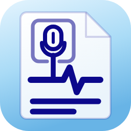
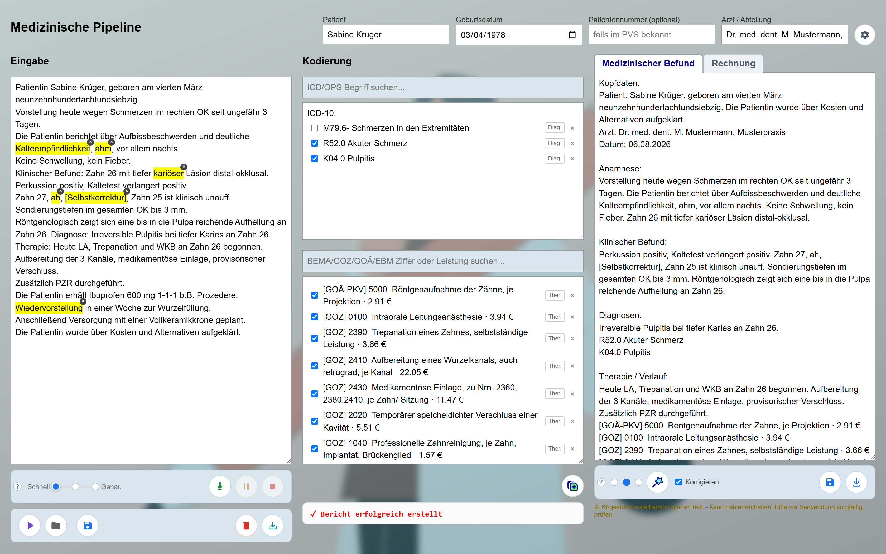
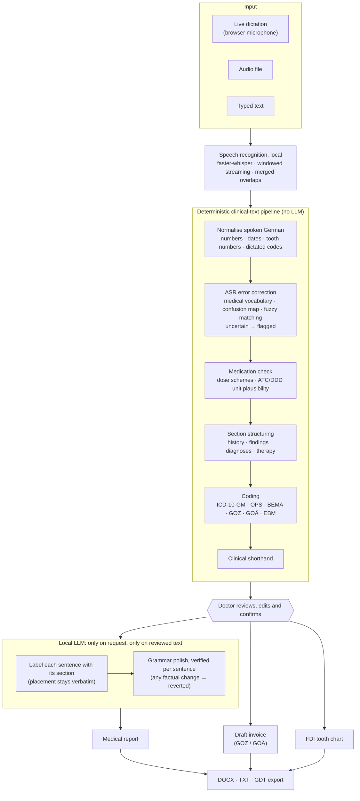
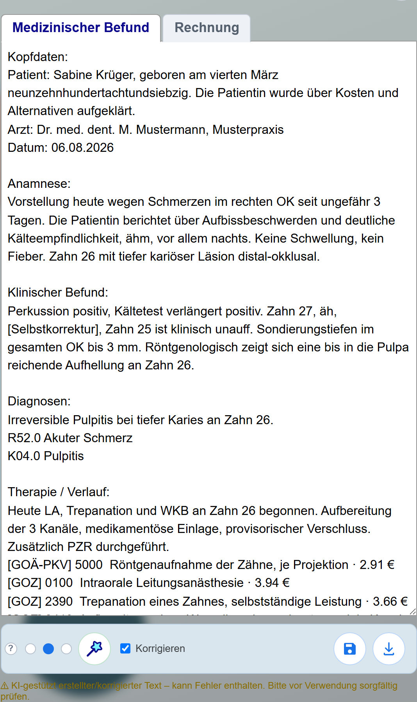
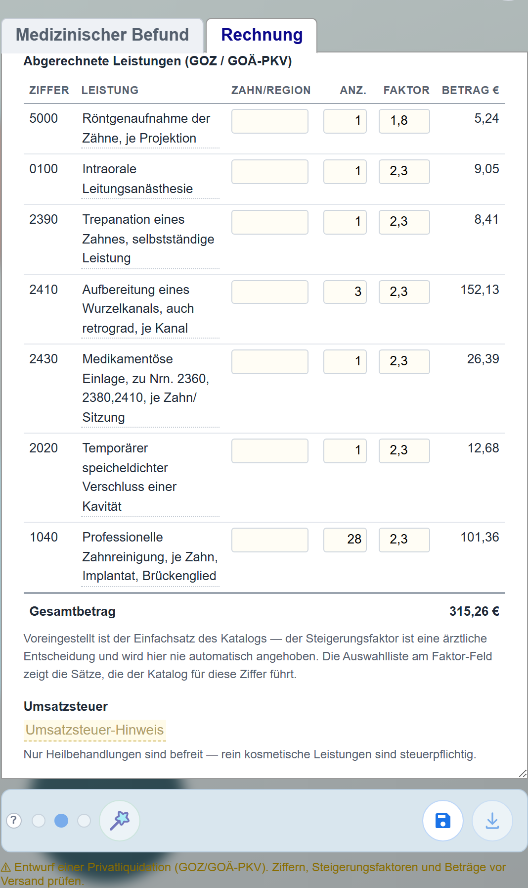
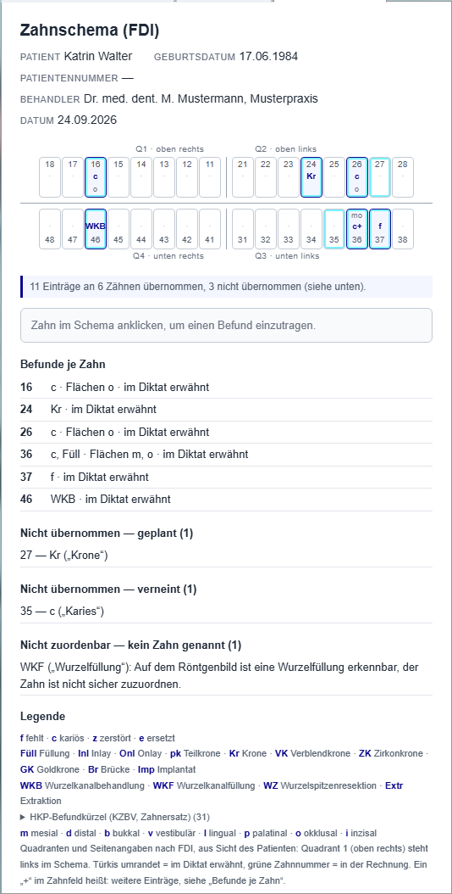
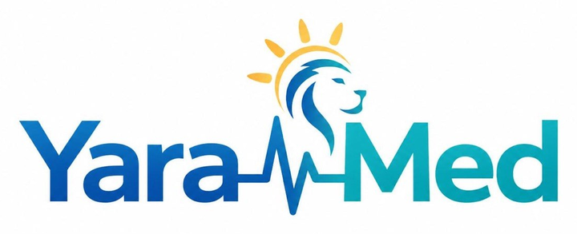

  

<h1 align="center">YaraDent</h1>

  <b>From dictation to finished documentation, on the practice PC, without the cloud.</b> 
  Speech recognition, clinical text processing, medical coding and billing for German medical and dental practices.

  
  
  
  
  
  
  

  

> **About this repository.** YaraDent is a commercial product by YaraMed. The source code is
> proprietary and kept in a private repository. This page describes what the system does and
> how it is engineered. A recorded [product demo](#demo-video) is below; a live demo or a guided
> walkthrough of the code is available [on request](#about).

The workspace with a fictional demo patient: the dictation (left), suggested codes for the doctor to confirm (centre), and the generated report (right). Highlighted words are flagged for review, not silently changed.

## What it does

A dentist or physician dictates during or after a treatment. YaraDent turns the dictation into:

- a **structured medical report** (*Befund*): patient header, history, findings, diagnoses, therapy, recommendations
- **suggested codes** for diagnoses (ICD-10-GM), procedures (OPS) and billable services (BEMA, GOZ, GOÄ, EBM). The doctor confirms every one.
- a **draft private invoice** (*Rechnung*) under the German dental and medical fee schedules (GOZ / GOÄ)
- an **FDI tooth chart** (*Zahnschema*) filled in from the dictated findings

Everything runs on the practice's own computer: speech recognition, the language model and all data.
No audio and no patient data leave the machine.

## Demo video

  

The complete product demo, covering all main functions. Click the image to watch on YouTube (in German).

## At a glance

| | |
|---:|:---|
| **~35,000** | lines of Python (backend), plus ~9,000 lines of frontend |
| **1,243** | automated tests |
| **~39,000** | entries from official catalogs: ICD-10-GM, OPS, EBM, BEMA, GOZ, GOÄ, WHO ATC/DDD |
| **100 %** | local processing: speech recognition and LLM run on the practice PC, on CPU or GPU |
| **Windows + macOS** | installable packages with integrity checks and pre-flight diagnostics |

## Engineering highlights

### Flag, don't guess
In clinical text, a confident wrong correction is worse than a visible gap, because it silently
corrupts a value the doctor signs. Every stage that cannot be sure **marks** the spot instead of
choosing. An unrecognised word becomes `[word?]`. A spoken self-correction ("Zahn 27, äh, nein,
Zahn 25") is flagged `[Selbstkorrektur]`. Filler words are highlighted, not deleted. The doctor
resolves each one in the UI. This rule shaped the whole architecture.

### A language model that cannot invent or drop content
Reports are generated by a small local LLM (Qwen 2.5 3B via Ollama) on an ordinary CPU. The model
does **not** rewrite the dictation. It only *labels* each numbered sentence with its report section,
and the code places the original sentence verbatim. Invented or lost content is ruled out by
construction, not by prompt wording.

An optional second pass polishes grammar sentence by sentence. Each rewrite is checked against its
own source sentence (numbers, doses, units, negation, laterality, time references, medical terms)
and reverted individually if anything other than the language changed. On its first live run, this
verifier caught the model turning *"Amlodipin 5 mg"* into *"2,5 mg"*.

The LLM only ever sees text the doctor has already reviewed, and only when the doctor asks for a
report.

### Measured, not guessed
Prompt changes are scored against hand-labelled gold sets on the live model, with evaluation tools
for section classification, grammar correction and speech-recognition settings. One prompt redesign
raised mean classification accuracy from **84.8 % to 92.4 %**. Three further, plausible-looking
refinements measured *worse* and were reverted.

Performance is measured the same way. Keeping the ~1,200-token instruction block byte-identical
across requests lets Ollama reuse its KV cache, which cut prompt evaluation from ~55 s to ~3 s
(**~20×**) on an 8 GB CPU-only machine.

### Live speech recognition on an office PC
Whisper (via faster-whisper / CTranslate2) runs locally. GPUs are auto-detected; CPU is the
fallback. While the doctor speaks, audio is cut at natural pauses into overlapping windows. Each
window is transcribed exactly once, and the overlaps are merged using word timestamps.

Getting the boundaries right, with no lost and no doubled words, needed a harness that replays real
recordings through the production code and compares the result against reference transcripts. The
final design was verified on five real dictations from different speakers. Model loads and decodes
are serialised to stay within 8 GB of RAM.

### How doctors actually speak → structured data
Deterministic, data-driven normalisation of spoken German medical language:

- spoken numbers and dates: *"vierten März neunzehnhundertachtundsiebzig"* → `04.03.1978`
- FDI tooth numbers: *"Zahn drei sechs"* → `36`, with guards so dosage schemes are not misread as teeth
- billing codes dictated digit by digit are looked up in the catalog; invalid ones are flagged
- ASR error correction using a curated medical vocabulary, a phonetic confusion map and fuzzy matching
- negation awareness: *"kein Fieber"* never becomes a diagnosis
- standard clinical shorthand (RR, DM, V. a.) applied as the very last step, so every earlier stage works on full words

### Medication safety
Dose and frequency phrases are normalised (`500 mg 1-0-1`) and checked for plausibility against the
WHO ATC/DDD reference (3,381 entries). An order-of-magnitude error such as milligrams heard as grams
is caught, and doses without a unit are flagged.

### Medical coding
ICD-10-GM (16,905 codes) and OPS (14,364 codes) are mapped in two passes. The first pass isolates
diagnosis and procedure phrases from the narrative. The second scores each phrase against the whole
catalog using IDF-weighted specificity, so a rare, specific term outweighs a common word. Billable
services (BEMA, GOZ, GOÄ, EBM) are suggested from the dictation's context. All codes arrive as
suggestions for the doctor to confirm.

### Fee-schedule rules, not just code lists
The draft invoice follows the GOZ / GOÄ rules. Fees come from the catalog tiers. The multiplier
(*Steigerungsfaktor*) is never raised automatically, because it is a medical decision. Any factor
above the standard rate requires a written justification, with a phrasing aid organised by the
statutory criteria (§ 5 Abs. 2). Dictated lab and material costs become their own invoice positions.
Issued invoices are stored write-once, and a yearly CSV export goes to the tax advisor.

### Tooth chart from the dictation
A deterministic extractor (no LLM) reads the findings and fills an FDI chart using the official KZBV
findings abbreviations. It keeps what is present apart from what is only **planned**, **negated**
(*"keine Karies an 35"*) or **not assignable** to a tooth, and lists each group separately. See the
screenshot below.

### Security and privacy by design
- localhost-only deployment: a middleware refuses every non-loopback request unless TLS is deliberately configured
- Argon2 password hashing, TOTP two-factor authentication, idle and absolute session timeouts, account lockout, CSRF enforcement
- an audit log of every request; accounts are provisioned by an admin, and there is no outbound email
- PostgreSQL with Alembic migrations, plus backup and restore tooling

### Shipping to real practices
- Windows and macOS from one code base, with a single platform switch
- installation packages carry a SHA-256 manifest, and a pre-flight check verifies every file and the
  environment. This was added after a real installation lost a file in transit while the earlier
  checks still reported "all OK".
- per-practice customisation is done with data-only overlay profiles, never a fork. With no profile
  active, behaviour is byte-identical, and tests enforce that.

## Architecture

## Tech stack

| Area | Technologies |
|---|---|
| Backend | Python 3.14, FastAPI, Uvicorn (plain ASGI middleware) |
| Speech | faster-whisper (CTranslate2), Silero VAD, ffmpeg; CUDA auto-detection |
| Language model | Ollama running locally: Qwen 2.5 3B by default, Qwen 3 8B and Mistral selectable |
| Data | PostgreSQL, SQLAlchemy, Alembic; a SQLite reference database compiled from the official catalog files (ClaML XML, XLSX, PDF) |
| Security | Argon2, TOTP (PyOTP), CSRF protection, audit middleware, loopback guard |
| Frontend | HTML, CSS and vanilla JavaScript; no build step, no external resources |
| Output | DOCX (python-docx), TXT, GDT |
| Quality | pytest (1,243 tests), gold-set evaluation tools, Playwright for automated demo capture |

## Screenshots

<table>
  <tr>
    <td width="33%"></td>
    <td width="33%"></td>
    <td width="33%"></td>
  </tr>
  <tr>
    <td><b>Medical report.</b> The dictation sorted into sections, with codes appended. Flags such as <code>[Selbstkorrektur]</code> stay visible until the doctor resolves them.</td>
    <td><b>Draft invoice.</b> GOZ / GOÄ positions with catalog fees. The multiplier stays at the standard rate unless the doctor changes it.</td>
    <td><b>Tooth chart.</b> Filled from the findings. Planned, negated and unassignable mentions are listed separately instead of being charted.</td>
  </tr>
</table>

All screenshots show fictional demo data. The user interface is in German, the language of its users.

## About

YaraDent is designed and built by **Dr. Hamed Hosseinpour** at **YaraMed**, with feedback from
practising dentists in Germany. For a demo or a walkthrough of the code, please get in touch:

  
  

© 2026 YaraMed. All rights reserved. This repository contains no source code. Text and images may not be reused without permission.
